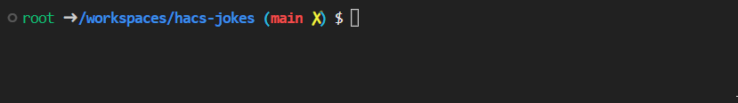

# CLI 'dev' tool

`dev --help`

## Features for now

* `dev ha start --help`: start Home Assistant
* `dev component activate --help`: activate your custom_components in /workspaces folder

## Tab Completion

* `ha <TAB><TAB>`
* for options type at least one `-` for them to show. 



## TODO / Future features

* bash autocompletion (is in /root/.bashrc, but doesn't work)
* configure launch.json, ~/.ssh for local/remote debugging on a Raspberry
* what do you have in mind? See next chapter :)
* ...

# Development/Contribute

Are you a Developer? Feel free to extend, that's what you need:

`/opt/dev/dev.py` does the magic.

* as command line parser we use [click_](https://click.palletsprojects.com/)

Entry Point is cli()

* we want to group all commands to a topic, currently 'ha' for Home Assistant, 'component' for custom_component management. Second parameter would be a sub-command (what to do with 'ha', e.g. 'start'), then options/parameters.

* to debug a command, add this code block and debug the dev.py file without parameters. This way breakpoints work.

```python
# for debugging: REMOVE THIS WHEN FINISHED
if __name__ == '__main__':
    # parameters you want to debug:
    cli(["ha", "start", "--restart"])
```

* when finished, start a pull request.

https://github.com/LaggAt/ha-devcontainer/pulls